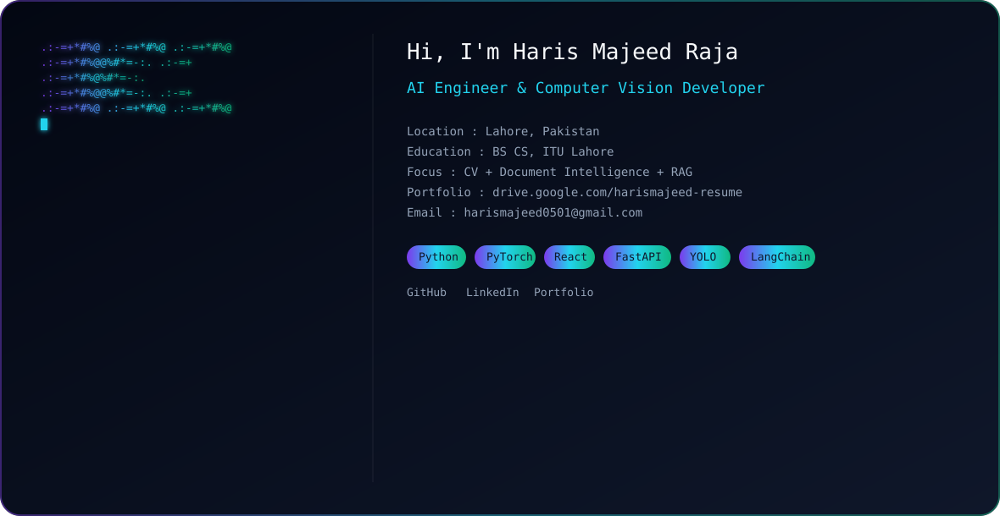

<picture>
  <source media="(prefers-color-scheme: dark)" srcset="assets/hero-dark.svg">
  <source media="(prefers-color-scheme: light)" srcset="assets/hero-light.svg">
  
</picture>

---

### About

AI Engineer working across computer vision and full-stack engineering, with hands-on experience in retrieval-augmented systems and real-time object detection. Currently building computer vision pipelines at **MLBench Pvt Ltd**. I like building systems from scratch to understand how they really work (compilers, search engines) before applying modern AI models on top of them.

- BS Computer Science, ITU Lahore, CGPA 3.28/4.0
- Final Year Project: **Multimodal Deepfake Detection using VLMs**, supervised by Dr. Waqas Sultani
- Teaching Assistant for Software Engineering and Artificial Intelligence at ITU
- Background across ML internships, front-end development, and Salesforce administration

---

### Core Competencies

**Languages**

**Machine Learning & Computer Vision**

**Full-Stack**

**Tools**

---

### Featured Projects

- **[Legal AI Chatbot](https://github.com/HarisMajeed05/legal-ai-chatbot)** — Full-stack RAG-based legal assistant using React, FastAPI, MongoDB, LangChain, FAISS, and the Groq API, with project-scoped retrieval and source-cited answers.
- **[Footfall Counter](https://github.com/HarisMajeed05/Footfall-counter-Yolo)** — Real-time people-counting system using YOLO/RT-DETR and ByteTrack, running entirely on CPU.
- **Multimodal Deepfake Detection (FYP)** — Detect-explain-judge pipeline (ExDDV-Judge) that cuts model size by over 80% versus large VLMs while running on a single consumer GPU.
- **[C++ Compiler From Scratch](https://github.com/HarisMajeed05/Cpp-Compiler-From-Scratch)** — Lexical analysis, recursive-descent parsing, semantic checks.
- **[Airbnb Clone (Extended)](https://github.com/HarisMajeed05/Airbnb-Inspired-Homepage)** — Full-stack clone with JWT auth and role-based access control.
- **[Search Engine](https://github.com/HarisMajeed05/Search-Engine)** — Custom C++ search engine using an inverted index.

---

### GitHub Stats

  
  

---

### Portfolio

  

---

### Resume

  

---

### Connect

  
  
  

