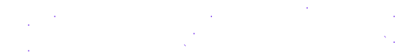
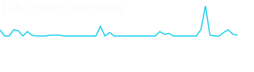
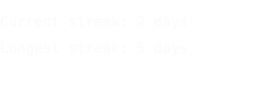
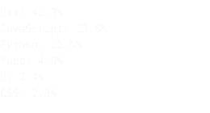

<table>
<tr>
<td width="440">

<!--
  ASCII portrait goes here once generated (see setup notes below).
  It replaces this placeholder with a self-typing, line-by-line
  reveal of your own headshot rendered as monospace characters.
-->
<pre>
   .:-=+*#%@ .:-=+*#%@
      .:-=+*#%@%#*=-:.
   .:-=+*#%@@%#*=-:.
      .:-=+*#%@%#*=-:.
   .:-=+*#%@ .:-=+*#%@
</pre>

</td>
<td width="600">

**Hi, I'm Haris Majeed Raja**
 
`AI Engineer` · `Computer Vision` · `Full-Stack`

 

<samp>
Location   : Lahore, Pakistan 
Education  : BS CS, ITU Lahore (CGPA 3.28/4.0) 
Role       : AI Engineer @ MLBench Pvt Ltd 
Focus      : Computer Vision, RAG, Document Field Detection 
Portfolio  : harismajeed05.github.io/portfolio 
Email      : harismajeed0501@gmail.com 
</samp>

 

<samp>Python · PyTorch · React · FastAPI · YOLO · LangChain</samp>

  

[GitHub](https://github.com/HarisMajeed05) · [LinkedIn](https://www.linkedin.com/in/haris-majeed-raja-390386267/) · [Portfolio](https://harismajeed05.github.io/portfolio/) · [Resume](https://drive.google.com/file/d/17BfmxrvdsJnaKDuiCunApBNM1tg35Ls3/view?usp=sharing)

</td>
</tr>
</table>

---

<blockquote>
I build systems from scratch to understand how they actually work, then apply modern AI models on top of that understanding. AI Engineer at MLBench Pvt Ltd, working on computer vision pipelines and OCR-based document field detection.
</blockquote>

 

- Final Year Project: **Multimodal Deepfake Detection using LLMs and VLMs**, supervised by Dr. Waqas Sultani
- Teaching Assistant for Software Engineering and Artificial Intelligence at ITU
- Background across ML internships, front-end development, and Salesforce administration

---

### Featured Projects

**Legal AI Chatbot** <samp>· React · FastAPI · MongoDB · LangChain · FAISS · Groq</samp> 
Full-stack RAG-based legal assistant with project-scoped retrieval and source-cited answers.
[Repo](https://github.com/HarisMajeed05/legal-ai-chatbot)

**Footfall Counter** <samp>· YOLO/RT-DETR · ByteTrack · OpenCV</samp> 
Real-time people-counting system with configurable virtual-line entry/exit counting, runs entirely on CPU.
[Repo](https://github.com/HarisMajeed05/Footfall-counter-Yolo)

**Multimodal Deepfake Detection (FYP)** <samp>· LLMs · VLMs · PyTorch</samp> 
Three-stage detect, explain, judge pipeline (ExDDV-Judge), over 80% smaller than baseline large VLMs, runs on a single consumer GPU.

**C++ Compiler From Scratch** <samp>· C++</samp> 
Lexical analysis, recursive-descent parsing, semantic checks.
[Repo](https://github.com/HarisMajeed05/Cpp-Compiler-From-Scratch)

**Airbnb Clone (Extended)** <samp>· React · Node.js · Express · MongoDB</samp> 
Full-stack clone with JWT authentication and role-based access control.
[Repo](https://github.com/HarisMajeed05/Airbnb-Inspired-Homepage)

**Search Engine** <samp>· C++</samp> 
Custom search engine using an inverted index for efficient text retrieval.
[Repo](https://github.com/HarisMajeed05/Search-Engine)

---

### Contribution Year

<!-- generated nightly by .github/workflows/refresh-stats.yml, drawn from your own contribution data, one character per day, same ramp as the portrait -->

  
  

---

### Portfolio

  

---

### Resume

  

---

### Connect

  
  
  

---

Portrait and contribution graphics are generated by this repository's own GitHub Action, no third-party stat services. Setup notes below.
