

<picture>
  <source media="(prefers-color-scheme: dark)" srcset="assets/portrait-dark.svg">
  <source media="(prefers-color-scheme: light)" srcset="assets/portrait-light.svg">
  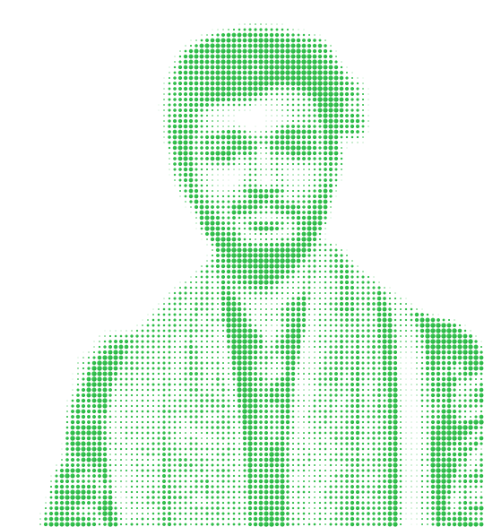
</picture>

   

 

~/ whoami
console
$ cat about.txt

Hi, I'm Haris Majeed Raja. AI Engineer building computer vision and RAG systems, from research to production.

One project at MLBench: replaced a client's three-model document form field detection pipeline with a single fine-tuned RF-DETR model
Portfolio: harismajeed05.github.io/portfolio
Learning lightweight VLM architectures for edge deployment
Fun fact: my final year project cut a deepfake-detection model's size by over 80% and still beat the baseline

<table><tr> <td width="50%" align="center"> <picture> <source media="(prefers-color-scheme: dark)" srcset="assets/radar-dark.svg"> <source media="(prefers-color-scheme: light)" srcset="assets/radar-light.svg"> 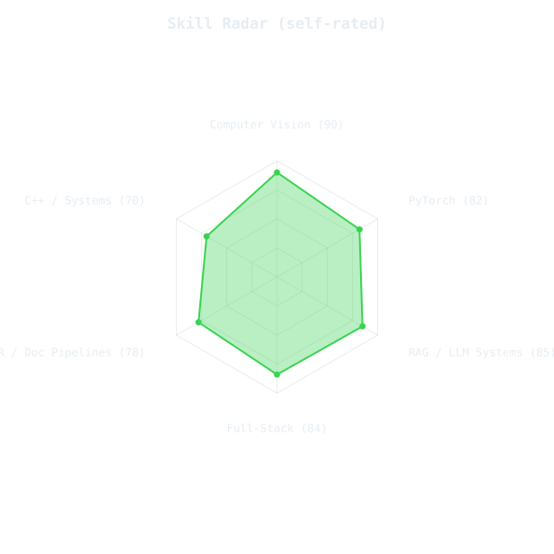 </picture> </td> <td width="50%" align="center"> <picture> <source media="(prefers-color-scheme: dark)" srcset="assets/radar-langs-dark.svg"> <source media="(prefers-color-scheme: light)" srcset="assets/radar-langs-light.svg"> 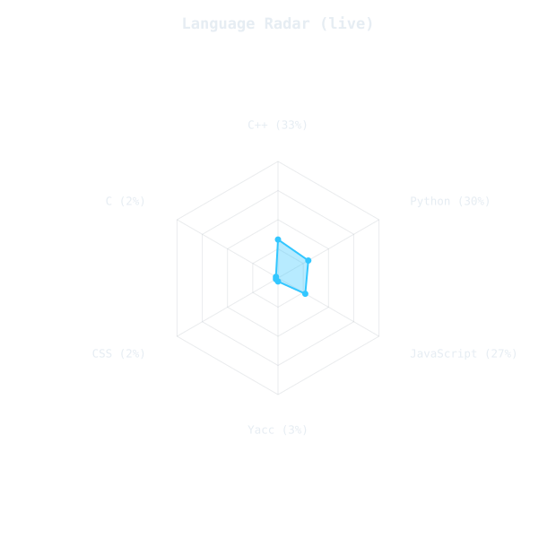 </picture> </td> </tr></table>

Left radar is self-rated (edit <code>assets/skills.json</code>). Right radar is computed live from actual language bytes across public repos, refreshed daily.

Stats
<picture> <source media="(prefers-color-scheme: dark)" srcset="assets/stat-card-dark.svg"> <source media="(prefers-color-scheme: light)" srcset="assets/stat-card-light.svg"> 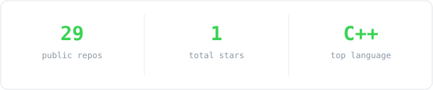 </picture>
Featured projects
<table> <tr> <td width="50%"> <a href="https://github.com/HarisMajeed05/Object-Defect-Detection"> <picture> <source media="(prefers-color-scheme: dark)" srcset="assets/card-object-defect-detection-dark.svg"> <source media="(prefers-color-scheme: light)" srcset="assets/card-object-defect-detection-light.svg"> 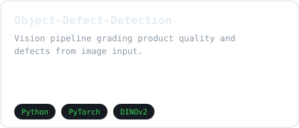 </picture> </a> </td> <td width="50%"> <a href="https://github.com/HarisMajeed05/legal-ai-chatbot"> <picture> <source media="(prefers-color-scheme: dark)" srcset="assets/card-legal-ai-chatbot-dark.svg"> <source media="(prefers-color-scheme: light)" srcset="assets/card-legal-ai-chatbot-light.svg"> 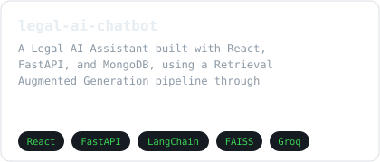 </picture> </a> </td> </tr> <tr> <td width="50%"> <a href="https://github.com/HarisMajeed05/Footfall-counter-Yolo"> <picture> <source media="(prefers-color-scheme: dark)" srcset="assets/card-footfall-counter-yolo-dark.svg"> <source media="(prefers-color-scheme: light)" srcset="assets/card-footfall-counter-yolo-light.svg"> 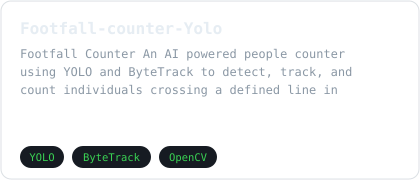 </picture> </a> </td> <td width="50%"> <a href="https://github.com/HarisMajeed05/YOLO-Model-Training-Deployment"> <picture> <source media="(prefers-color-scheme: dark)" srcset="assets/card-yolo-model-training-deployment-dark.svg"> <source media="(prefers-color-scheme: light)" srcset="assets/card-yolo-model-training-deployment-light.svg"> 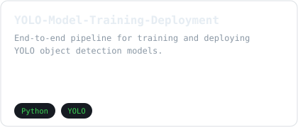 </picture> </a> </td> </tr> <tr> <td width="50%"> <a href="https://github.com/HarisMajeed05/brainbox-ai-chatbot-app"> <picture> <source media="(prefers-color-scheme: dark)" srcset="assets/card-brainbox-ai-chatbot-app-dark.svg"> <source media="(prefers-color-scheme: light)" srcset="assets/card-brainbox-ai-chatbot-app-light.svg"> 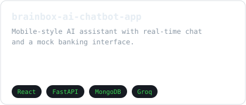 </picture> </a> </td> <td width="50%"> <a href="https://github.com/HarisMajeed05/AI-Meeting-Summarizer"> <picture> <source media="(prefers-color-scheme: dark)" srcset="assets/card-ai-meeting-summarizer-dark.svg"> <source media="(prefers-color-scheme: light)" srcset="assets/card-ai-meeting-summarizer-light.svg"> 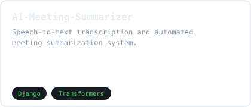 </picture> </a> </td> </tr> <tr> <td width="50%"> <a href="https://github.com/HarisMajeed05/Cpp-Compiler-From-Scratch"> <picture> <source media="(prefers-color-scheme: dark)" srcset="assets/card-cpp-compiler-from-scratch-dark.svg"> <source media="(prefers-color-scheme: light)" srcset="assets/card-cpp-compiler-from-scratch-light.svg"> 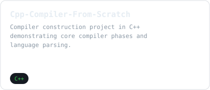 </picture> </a> </td> <td width="50%"></td> </tr> </table>

Stars, forks, and language on each card update daily, pulled live from the GitHub API. To change which repos appear, edit <code>assets/projects.json</code>.

Contribution calendar
 
Resume

  
 
 01100010 01110101 01101001 01101100 01100100 

Project content
Haris
Created by you
Add PDFs, documents, or other text to reference in this project.
Content
Comment “upgrade” and I’ll send the prompt.GitHub, ai, coding, development, DSA, leetcode, tech,.mp4

MP4

🎮 Playing Rocket GameNah… it’s my GitHub README. 🚀I turned my GitHub contribution heatmap into.mp4

MP4

Comment something and I’ll send you the tutorial.mp4

MP4

Your GitHub profile is more than just a repository—it’s your developer portfolio.Instead of usin.mp4

MP4

Your GitHub profile is your developer identity. Instead of a plain profile, I created a premium.mp4

MP4

Giving my github a little makeover✨....#explore #github #readme #githubprofile.mp4

MP4

<h1 align="left"> Hi there, I'm Haris Majeed Raja  </h1> 
  . It replaces this placeholder with a self-typing, line-by-line reveal of your own headshot rendered as monospace characters. -->  <

PASTED

 . It replaces this placeholder with a self-typing, line-by-line reveal of your own headshot rendered as monospace characters. --> <pre> .:-=+*#%@ .:-=+*#%@ .:-=+*#%@%#*=-:.

PASTED

~ / p r o f i l e - r e a d m e . g u i d e Build a GitHub profile that isn't a wall of badges. Every step I took to make mine — the magic repo, the dot- matrix portrait, the charts that draw themselves, and the three robots that keep it all current while I sleep. Gargi Bhardwaj githu

PASTED

Annotations 2 errors and 1 warning metrics Process completed with exit code 1. metrics You must provide a valid GitHub personal token to gather your metrics (see <https://github.com/lowlighter/metrics/blob/master/.github/readme/partials/documentation/setup/action.md> for more informations) metri

PASTED

 . It replaces this placeholder with a self-typing, line-by-line reveal of your own headshot rendered as monospace characters. --> <pre> .:-=+*#%@ .:-=+*#%@ .:-=+*#%@%#*=-:.

PASTED

 <picture> <source media="(prefers-color-scheme: dark)" srcset="assets/portrait-dark.svg"> <source media="(prefers-color-scheme: light)" srcset="assets/portrait-light.svg"> 

PASTED
